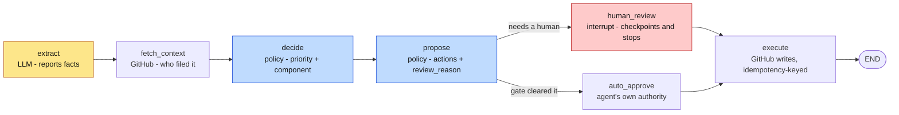

# Issue Triage Agent

[](https://github.com/ShauRya765/issue-triage-agent/actions/workflows/test.yml)

A LangGraph agent that takes a real open issue from [vercel/next.js](https://github.com/vercel/next.js),
extracts facts about it with an LLM, decides what to do with it using plain
Python rules, pauses for a human to approve or edit the proposed actions, and
then executes them (or, in `SHADOW_MODE`, just says what it would have done).

## Results at a glance

| | |
|---|---|
| **Component-label accuracy** | **74.0%** on 150 closed issues, 95% CI [66%, 80%]. An identical re-run scored 73.3%. |
| **vs. naive baselines** | 37.3% always-guess-the-most-common-label, 16.9% weighted random -- the agent is **2.0x** the majority-class bar, and 3.4x once the dominant label is removed. |
| **Failure split** | 18.7% abstained to `needs-triage`, 7.3% applied a wrong label. Abstentions can never execute without a human. |
| **Cost and latency** | **$0.0082** per triaged issue; **3.3s** median, **6.5s** p95. |
| **Durable pause** | **Verified against real Postgres**, not just `MemorySaver`: one process paused at human review and exited, a second process recovered the state, applied an *edited* action list, and executed it -- once. |
| **Who decides** | Plain Python in `app/policy.py`, never the model. It makes zero LLM calls, and its tests pass with no API key and no network. |

Details: [Results](#results) · [Cost and latency](#cost-and-latency) · [Human in the loop](#human-in-the-loop-and-running-alone)

## The central design rule

**The model extracts, the code decides.**

| | Model (`app/extract.py`) | Code (`app/policy.py`) |
|---|---|---|
| Can decide | What the issue text says: has a version, has a repro, has logs, has expected behaviour, claimed area, confidence in that claim, kind of issue | Priority (P0-P3), which label to apply, what "enough information" means, which actions to take, **and whether a human must approve the run** |
| Cannot decide | Priority, labels, actions, sufficiency of information, whether to act alone | Anything about the issue's content -- it only ever sees facts already extracted, the raw issue body for literal pattern matching, and a fetched context record |

A third input sits alongside the model: `app/context.py` looks up *who filed
the issue* from the GitHub API. That's a fetch, not a judgment -- no model is
involved -- and `policy` reads it the way a human triager glances at who
opened a ticket before deciding how fast to move.

Concretely: `app/policy.py` makes zero LLM calls and imports nothing from
`app/graph.py`. Its public functions (`priority`, `component`, `actions`,
`review_reason`, `requires_review`, `validate_actions`) are pure functions over
a `Facts` dict, a list of GitHub labels, and a fetched context record.
`tests/test_policy.py` passes with `ANTHROPIC_API_KEY` unset and no network
access -- that's the proof the decisions don't depend on the model. If you
find yourself wanting an LLM call inside `policy.py`, the fix is a new field
on `Facts` extracted by the model, not a new import.

Why this split, concretely: an LLM can misjudge severity, or drift over time
as prompts get tweaked, and there's no way to unit test "the model's
judgment." A regex for "data loss" or a check for `area_confidence == "high"`
is auditable, testable offline, and won't silently change behavior when you
swap models.

## Why `vercel/next.js`, and the label vocabulary check

Before writing any graph code, `scripts/check_labels.py` was run against the
real repo:

```bash
python scripts/check_labels.py
```

Findings (176 non-PR closed issues sampled):

```
129  invalid link      <- bot/moderation label, not a component
 24  locked
 18  Turbopack
 14  Runtime
 11  Performance
 11  Dynamic Routes
  6  Output
  5  Linking and Navigating
  4  Middleware
  4  Internationalization (i18n)
  3  TypeScript / Cache Components / Webpack
  2  Error Overlay / Headers / Parallel & Intercepting Routes / Metadata /
     Redirects / Module Resolution / Pages Router / Not Found
  1  Form (next/form) / Cookies / create-next-app / Script (next/script) /
     SWC / React / Route Handlers
```

First pass at "how many of 100 closed issues carry exactly one component
label" came back at **21/100** -- small, as flagged as the stop-and-check
threshold. The reason: `vercel/next.js` bot-closes a large fraction of
issues via `invalid link`/`locked` before a human ever triages them; those
issues were never candidates for a component label, so counting them as
eval-eligible understates the real signal.

Excluding bot-closed issues (only `invalid link`/`locked` labels) from the
pool and recomputing on the remaining genuinely-triaged issues:

```
64 genuinely-triaged closed issues
31 / 64 carry exactly one component label (~48%)
```

That estimate held up when the eval was later scaled to 800 fetched issues:
175 of the 351 non-bot-closed ones qualify, or 49.9%. See [Results](#results).

`COMPONENTS` (in `.env.example` / `app/policy.py`) is exactly the real
non-noise label vocabulary found by that script -- not a guessed list.
`vercel/next.js` applies component labels as bare names (`Turbopack`,
`Runtime`, ...), not with a colon prefix, so `LABEL_PREFIX` defaults to
empty; it's kept as a knob for repos that do use one.

For the problems hit while building this and why each was resolved the way it
was, see [ENGINEERING_NOTES.md](ENGINEERING_NOTES.md).

## Files

```
app/state.py     TypedDict state threaded through the graph
app/github.py    httpx client: fetch_open, fetch_closed, fetch_issue,
                 add_label, comment -- writes respect SHADOW_MODE
app/extract.py   the only LLM calls (claude-sonnet-5 via langchain_anthropic);
                 JSON-only prompt, parse returns {} on any failure
app/context.py   reporter lookup (tier + prior issue count); a fetch, no LLM,
                 fails soft to unknown
app/policy.py    every decision; pure, offline, no LLM, no graph import --
                 priority, component, actions, review_reason, validate_actions
app/graph.py     extract -> fetch_context -> decide -> propose -> (human_review
                 interrupt | auto_approve) -> execute, checkpointed to Supabase
app/main.py      FastAPI: GET /issues, POST /runs, POST /runs/{number},
                 POST /runs/{number}/approve, GET /runs/{number}
app/usage.py     cost + latency telemetry: per-call tokens/wall time/model/
                 node, aggregated per run, priced from env rates
eval/replay.py   fetch closed issues (cached to eval/cache/), run the same
                 extract+policy path in parallel, score predicted vs actual
                 component label with per-component precision and recall
tests/test_policy.py      priority, component, actions, escalation, the
                          autonomy gate, action validation
tests/test_context.py     tier mapping and the fail-soft paths
tests/test_graph.py       routing, the pause, edited approvals, idempotency
tests/test_eval.py        the eval's exclusions and scoring arithmetic
tests/test_usage.py       cost arithmetic, rate config, usage collection
tests/conftest.py         blocks sockets, so the suite can't quietly go online
ENGINEERING_NOTES.md      decisions, tradeoffs and what's still unproven
scripts/check_labels.py   the label-vocabulary check described above
scripts/check_db.py       connects to DATABASE_URL, runs the checkpointer's
                          setup(), reports the checkpoint tables it found
```

## Running it

Dependencies:

```bash
python3 -m venv venv
./venv/bin/pip install -r requirements.txt
cp .env.example .env   # fill in ANTHROPIC_API_KEY, DATABASE_URL
```

Unit tests (no API key, no network):

```bash
./venv/bin/python -m pytest tests/ -q
```

That claim is enforced, not just asserted. `tests/conftest.py` blocks socket
creation for every test, so a test that reaches for api.anthropic.com,
api.github.com or Postgres fails with `NetworkUsedInTest` instead of quietly
passing on a machine that happens to have credentials. CI
([`.github/workflows/test.yml`](.github/workflows/test.yml), the badge at the
top) runs the same suite on a clean checkout with no secrets configured and
fails the build if `ANTHROPIC_API_KEY` or `DATABASE_URL` is set -- so a green
badge means all 114 tests passed with no key, no database and no network.

Eval (needs `ANTHROPIC_API_KEY`; `REPO` defaults to `vercel/next.js`):

```bash
./venv/bin/python -m eval.replay --n 150 --version v4
```

Scores 150 issues, which means fetching 800 (`--fetch`) because only ~22% of
closed issues qualify. Extraction runs 8-way parallel (`--concurrency`); at that
setting a 150-issue run takes about 75 seconds, and `extract_facts` backs off on
429s so raising it trades throughput for retries.

Fetched issues are cached to `eval/cache/`, so only the first run hits the GitHub
API -- a rerun starts in about a second, and every version is scored against the
same sample rather than a fresh one that has drifted. Pass `--refresh` to
re-fetch.

Prints the sample funnel, accuracy with a 95% confidence interval, the majority-
class and random baselines over the same scored set, the abstention and mislabel
rates, per-component precision and recall, and the most common want-to-got
confusions; writes per-issue rows to `eval/results/v4.json`.

API (needs `DATABASE_URL` pointing at a real Postgres -- the durable pause
depends on it). This project uses **Supabase** for that Postgres:

1. Create a project at [supabase.com](https://supabase.com) (free tier is
   enough -- the checkpointer writes a few KB per run).
2. Project -> **Connect** -> copy a Postgres URI. Prefer the **session pooler**
   (`aws-0-<region>.pooler.supabase.com:5432`); the direct `db.<ref>.supabase.co`
   host is IPv6-only and unreachable on many home/office networks.
3. Paste it into `.env` as `DATABASE_URL`, substituting the database password
   for `[YOUR-PASSWORD]`, and keep `?sslmode=require`.
4. Confirm it works before starting the API:

```bash
./venv/bin/python scripts/check_db.py
```

That creates the `checkpoints*` tables in the `public` schema and prints them.
Then:

```bash
./venv/bin/python -m uvicorn app.main:app --reload
```

- `GET /issues?n=20` -- list open issues
- `POST /runs?n=10` -- triage a batch unattended; the entry point a cron job
  or worker calls. Returns per-issue status
- `POST /runs/{number}` -- start one run. Returns `awaiting_approval` with the
  proposed facts/priority/component/actions, or `executed_autonomously` if the
  routing gate cleared it
- `POST /runs/{number}/approve` -- body `{"actions": [...]}` to use an edited
  list, or `{}`/omitted to approve as proposed; executes and returns the log
- `GET /runs/{number}` -- inspect the checkpointed state at any point,
  including after a restart

To confirm the durability claim yourself: start a run, kill the `uvicorn`
process before approving, start it again, then `POST /runs/{number}/approve`
-- it resumes from the Postgres checkpoint, not from memory.

Supabase's transaction pooler (port 6543) also works: `app/graph.py` opens the
connection with `prepare_threshold=None`, since pgbouncer in transaction mode
rejects the prepared statements psycopg would otherwise use. The session pooler
is still the safer default because it can hold session state.

The checkpoint tables live in Supabase's `public` schema, which is exposed via
PostgREST. They contain issue text and proposed actions, not secrets, but
nothing in this app needs anon-key access to them -- leave RLS on and reach
them only through `DATABASE_URL`.

**Durability: verified.** The restart test above has been run end to end
against a real Supabase project (Postgres 17.6, session pooler). One process
started a run and exited at the `human_review` pause; a second, unrelated
process -- knowing only the issue number -- recovered the full state from
Postgres, applied an *edited* action list, and executed it. Resuming that
completed thread a second time executed nothing further, confirming the
idempotency-key check across process boundaries.

`tests/test_graph.py` covers the same control flow against `MemorySaver` so it
stays testable offline; the durability claim specifically is what needed the
real database.

## Human in the loop, and running alone

The graph has exactly one branch, after `propose`:



The one LLM node is amber, the two nodes that make decisions are blue, and the
pause is red -- the colours are the design rule made visible: nothing amber
decides anything.

Both paths converge on the same `execute` node, so an autonomous run and an
approved run execute through identical code, including the idempotency check.

**The human path.** `human_review` calls `interrupt()`, which checkpoints and
stops. The reviewer can approve as proposed, or POST a different list to
replace it wholesale -- that edited list is what executes. Edits are validated
against the repo's real label vocabulary before anything resumes
(`policy.validate_actions`), because once `execute_node` starts calling GitHub
a bad action partway down the list can't be rolled back.

**The autonomous path.** `AUTONOMOUS=false` (the default) sends every run to a
human regardless. With it on, `policy.review_reason` decides, and it fails
towards the human -- it returns the *reason* a run stopped, which gets recorded
on the state, so a paused run can be explained later without re-deriving it. A
run executes alone only when all of these hold:

| Condition | Why |
|---|---|
| Not a P0 | The case where being wrong is most expensive |
| No comment action | A label is silently removable; a comment emails every subscriber and can't be unsent |
| Component identified | Failing to route is exactly when a human adds value |
| `area_confidence == "high"` | Low confidence is the model telling you to check |
| Extraction succeeded | `extract_facts` returns `{}` on failure; don't act on an extraction that didn't happen |
| Reporter context available | Don't apply a rule whose inputs are known to be incomplete |

`POST /runs` triages a batch with no issue number in the request -- that's what
lets a scheduler start work unprompted. Every issue still goes through the same
gate.

## Customer context

`app/context.py` fetches, per issue: the reporter's login, a tier normalised
from GitHub's `author_association` (`internal` / `contributor` / `external`),
and how many issues they've previously filed on the repo.

`policy.priority` uses it to escalate **at most one step, and never to P0** --
P0 stays reserved for the hard signals (a security label, a data-loss or
build-breaking pattern). Who filed something is never on its own grounds to
call it a P0, or the label stops meaning "drop everything" and starts meaning
"someone important is watching." Escalation applies to maintainers, and to
contributors with at least `ESTABLISHED_REPORTER_ISSUES` prior filings.

A failed lookup returns `unknown=True`, which suppresses escalation entirely
and forces human review. It deliberately does *not* fall back to `external`:
that would silently deprioritise a maintainer's report the moment the search
API got rate limited.

On a commercial support desk these fields would come from a CRM -- plan tier,
contract value, open ticket count. The shape is the same either way: a fetched
record about the requester, kept separate from the request text, feeding a rule
rather than a prompt. Swapping in a CRM means rewriting `app/context.py` alone;
`Facts`, `policy`'s signature and the graph don't move.

`SHADOW_MODE` defaults to `true`: every `add_label`/`comment` call returns a
descriptive string and writes nothing to GitHub. This project doesn't own
`vercel/next.js`, so shadow mode should stay on unless you're pointing it at
a repo you control.

## Cost and latency

Measured on the v5 run: the same 150 issues, `claude-sonnet-5`, priced at its
list rate of $2.00/$10.00 per million input/output tokens. Both rates are read
from `COST_PER_MTOK_INPUT` / `COST_PER_MTOK_OUTPUT`, because the rate is a
deployment fact -- a different model, a negotiated rate, or Bedrock/Vertex
billing all change it, and none of those should need a code edit to price
correctly.

| | Per triaged issue | Over 150 issues |
|---|---|---|
| Cost | **$0.0082** (0.8 cents) | $1.23 |
| Input tokens | 2,283 | 342,000 |
| Output tokens | 362 | 54,000 |
| LLM calls | 1 | 150 |

Latency, per issue, extraction only:

| | |
|---|---|
| median | **3.3s** |
| p95 | **6.5s** |
| max | 9.7s |

Those are the eval's numbers, and the eval calls `extract_facts` directly. A
full graph run also fetches reporter context, so measured end-to-end over real
issues (6 runs, to the interrupt) the per-node median breaks down as:

```
extract         5.28s     <- the model call
fetch_context   0.48s     <- GitHub search API
decide          0.00s     <- pure Python
propose         0.00s
TOTAL           5.68s     (max 9.94s)
```

Extraction is ~93% of a run. That is the whole reason every node is timed and
not just the LLM one: before measuring, the GitHub lookup was the plausible
suspect, and it turned out to be under half a second.

**What dominates the cost: input tokens, at 56% of the bill (output is 44%) --
and within those, the issue text itself, not the prompt.** The fixed system
prompt is ~855 tokens of the 2,283-token average input, so 37% of input and 21%
of total cost; the other 63% is the issue body, which varies from a one-line
report to a full stack trace. The practical consequence is that the one clearly
addressable piece of waste is that 855-token prompt, identical on every call and
resent every time: prompt caching would cut most of that 21%, and it is not
enabled here. Beyond that, cost scales with how much users write, which is not
something the agent controls.

At 0.8 cents per issue, triaging every issue `vercel/next.js` closes in a day is
a rounding error; the reason to watch the number is that it is per-issue and
linear, so a repo with 100x the volume pays 100x.

One detail the v5 run justified: usage is recorded *before* the response is
parsed. v5 had one extraction fail to parse, and all 150 calls still show in the
token totals -- a reply that comes back unusable cost exactly as much as one that
worked, and accounting that hid it would understate the real spend.

Telemetry is recorded per call (`input_tokens`, `output_tokens`, `wall_ms`, the
model that actually served it, and the node that made the call) and per node
execution, then aggregated onto the graph state. `GET /runs/{number}` returns
the aggregate, recomputed from the raw records so it reflects the currently
configured rates. It is recomputed by every node rather than once at the end, so
a run parked at the human-review interrupt can still report what it has spent --
and because the thread id is permanent per issue, re-running an issue adds to
its bill rather than resetting it, which is the honest accounting.

## Results

Run against `vercel/next.js` closed issues. Two filters decide what is scorable,
and the funnel is printed on every run so the sample is auditable:

```
fetched closed issues                800
- bot-closed (invalid link/locked)   449
- no single component label          176
= eligible to score                  175
scored                               150
```

Bot-closed issues are excluded because an issue whose only labels are
`invalid link` / `locked` was closed by automation and never triaged -- there is
no maintainer judgment there to score against. That exclusion is defined once,
in `eval/replay.py`, and imported by `scripts/check_labels.py` so the two can't
drift. Of what survives, only issues carrying exactly one `COMPONENTS` label are
scored: zero means nobody routed it, two or more means "the right answer" isn't a
single value.

Those two filters are why scoring 150 means fetching 800: only ~22% of fetched
issues survive both. That is the same finding as the vocabulary check's ~48%,
not a contradiction -- 175 of the 351 non-bot-closed issues qualify (49.9%,
confirming the earlier 31/64 estimate at 5x the sample), and 56% of everything
fetched is bot-closed before that filter even applies.

| | n scored | Accuracy | 95% CI | Change |
|---|---|---|---|---|
| *baseline: random* | 150 | 16.9% | -- | Guess a component with probability equal to its frequency; expected accuracy is the sum of squared frequencies. Reads the issue not at all. |
| *baseline: majority class* | 150 | 37.3% | -- | Always answer `Turbopack` (56 of 150). Reads the issue not at all. |
| v1 | 15 | 40.0% | [20%, 64%] | First real run. 3/15 extractions failed outright (`response.content` arrives as a list of content blocks on newer models, not a string -- the regex in `_parse_response` raised `TypeError`). |
| v2 | 15 | 53.3% | [30%, 75%] | Content-block handling fixed; zero extraction failures. Every remaining miss abstained to `needs-triage` -- not one wrong label. |
| v3 | 15 | 66.7% | [42%, 85%] | Injected the real label vocabulary into the extraction prompt. Diagnosis: the model was confident (6/7 misses at `high`) but naming areas that don't exist -- `next-devtools`, `Use Cache`, `Telemetry`. It was guessing a taxonomy nobody had shown it. |
| v4 | **150** | **74.0%** | **[66%, 80%]** | **Sample size only.** Identical prompt, identical policy -- v4 is v3 measured properly, not a new change. |
| v5 | 150 | 73.3% | [66%, 80%] | Cost/latency instrumentation added; prompt and policy still identical. Same 150 issues, so this doubles as a same-config replication of v4: 73.3% vs 74.0% is one issue's difference, which is what run-to-run variance looks like at this n. |

Both baselines are computed by `eval.replay` over the same scored set as the
headline number, and printed on every run. They are sample-specific, so the two
rows above describe v4's 150 issues; on the 15-issue sample that v1-v3 used, the
majority-class bar was 26.7% and random was 14.7%. Read each version against the
bar for its own sample -- v1's 40%, for instance, is only ~1.5x its sample's
majority class, which is the correct way to see that a silently-broken extractor
was barely beating a constant answer.

**v4 differs from v3 in exactly one respect: the number of issues scored.** The
extraction prompt, `app/policy.py`, and the model (`claude-sonnet-5`) are
unchanged between the two. Nothing was tuned in response to v3's output. The
point of the run was to find out what the v3 system actually scores, because
n=15 could not tell us. The samples nest cleanly, too: v1, v2 and v3 all scored
the *same* 15 issues, and all 15 are among v4's 150, so v4 is a strict superset
rather than a fresh draw.

**What that bought, and what it cost.** v3's interval was 43 points wide; v4's is
14. But those intervals overlap heavily, so v4 is *not* evidence that the system
improved -- 74.0% is the better estimate of what v3 was already doing, and the
honest reading is that v3's 66.7% was a noisy sample of roughly this. The same
caveat applies backwards: the v1 -> v2 -> v3 deltas were each measured at n=15,
so their direction is more trustworthy than their size.

**Is 74% good? Yes, and by a clear margin -- it is 2.0x the majority-class
baseline.** That is the comparison worth stating plainly, because it is the one
that could have gone badly: on a repo where 37% of triaged issues are `Turbopack`,
a classifier that had learned nothing except "say Turbopack" would score 37.3%,
and a respectable-looking number can hide exactly that. This one doesn't. The
distance from 37.3% to 74.0% is the part attributable to actually reading the
issue.

**And the margin widens on the hard part of the sample.** `Turbopack` is 56 of
the 150 scored issues (37%), and it is the label the extractor handles best --
98.1% precision, 94.6% recall -- so the obvious worry is that the dominant class
is carrying the headline. Removing it tests that directly: on the remaining 94
issues the agent scores 61.7% against a majority-class bar of 18.1% (`Runtime`),
a lift of 3.4x rather than 2.0x. So the 74% is *diluted* by Turbopack in relative
terms, not propped up by it -- the easy class raises the absolute number while
lowering the multiple. What remains true is that 74% describes this repo's label
distribution, and a repo with no dominant area would report a lower absolute
accuracy for the same underlying quality.

**The 26% of misses splits 18.7% abstentions / 7.3% mislabels.** That asymmetry
is the number to watch, because the two failures cost different things: a
`needs-triage` result can never execute without a human (see the autonomy gate),
while a wrong label is a wrong action taken autonomously. Per-component
precision and recall are printed for the same reason -- precision is what
justifies letting a label apply itself, recall is how much triage work actually
gets absorbed, and abstaining costs recall while never costing precision.

Two components account for most of the damage:

- **`Runtime` recall is 23.5%** (4 of 17 found) -- the worst in the sample. It's
  a catch-all area whose issues don't announce themselves, and 9 of the 13 misses
  abstained rather than guessed.
- **`Cache Components` precision is 36.4%** -- 11 predictions against 5 real
  ones. It has become the sink the model reaches for when an issue mentions
  caching at all, pulling in `Runtime`, `Performance`, `React` and `Headers`.
  This is the one place the constrained vocabulary from v3 actively backfired,
  and it's the obvious next thing to fix.

**On the one change to the measured path.** `extract_facts` gained retry with
jittered backoff on 429/529, because `--concurrency` makes rate limiting the
expected case and a swallowed 429 would have scored as a miss -- deflating
accuracy for a reason unrelated to the prompt. It is a reliability change, not a
prompt change, and it demonstrably didn't alter the outcome here: v4 recorded
zero extraction failures, so no retry changed a row.

Earlier runs are kept rather than overwritten: `eval/results/v1.json` is the
record of what a silently-broken extractor scores, which is the comparison that
makes the later numbers meaningful. Fetched issues are cached to `eval/cache/`
(gitignored, ~3MB), so re-running scores every version against the same sample
instead of a fresh one that has drifted.
